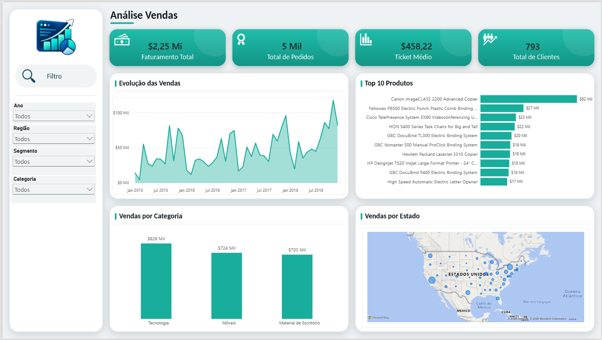

# Análise de Vendas com Python e Power BI

Projeto de análise de dados de vendas desenvolvido com Python, Pandas e Power BI, passando pelas etapas de exploração, limpeza, tratamento, análise exploratória e visualização dos dados.

## Objetivo

Analisar o desempenho das vendas e identificar padrões relacionados a faturamento, pedidos, categorias, regiões, produtos e evolução das vendas ao longo do tempo.

## Tecnologias Utilizadas

- Python
- Pandas
- Jupyter Notebook
- Power BI
- Git e GitHub

## Etapas do Projeto

1. Importação e exploração inicial dos dados
2. Verificação da qualidade dos dados
3. Limpeza e tratamento
4. Análise exploratória
5. Identificação de tendências e padrões
6. Desenvolvimento do dashboard no Power BI

## Principais Indicadores

- **Faturamento total:** US$ 2.252.607,41
- **Quantidade de pedidos:** 4.916
- **Ticket médio:** US$ 458,22

## Dashboard

🚧 Dashboard em desenvolvimento no Power BI.


## Estrutura do Projeto

```text
analise-vendas-pandas-powerbi/
├── data/
│   ├── raw/
│   └── processed/
├── notebooks/
└── README.md
